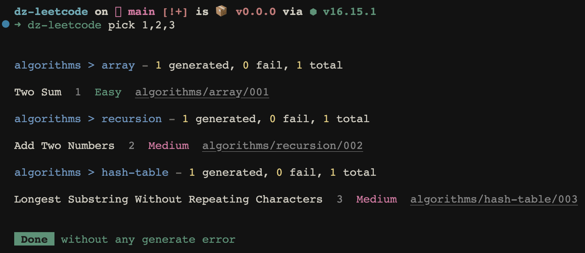

# dz-leetcode

> a cli tool that generates leetcode question docs and runtime code & testcase

## Features

* it will generate four parts are as follow:
    * catelog
    * markdown (with title & solution template)
    * code
    * testcases
* the pattern of generated doc's link is `category`/`tag`/`questionId`
    * you can decide to specify `category` and `tag` or not, if you not, it will be generated by the origin property of question by default.
    * you can visit the generated question by site `http://localhost:5173/category/tag/questionId`
    * [Online view genereated docs](https://dz-leetcode.netlify.app)

## Basic Commands

```bash
# installation
pnpm i
# local run cli
pnpm dev
# view generated docs
# http://localhost:5173/
pnpm dev:docs
# local register cli
pnpm build
npm link
#or
pnpm link dz-leetcode
```

## Usage

### I. generate questions with specific file

```bash
dz-leetcode file -f example/questions.yml
```

<p align='center'>
  
</p>

### II. generate picking questions with (title or id) or multiple (title or id)s with `,`

```bash
dz-leetcode pick <title|id, <title|id...>>
#or
dz-leetcode pick two-sum
#or
dz-leetcode pick 1,2,3
```

<p align='center'>
  
</p>

### III. generate one random question

```bash
# fully range random (fully category & tag & difficulty)
dz-leetcode random
# interactive mode
dz-leetcode random -i
```

<p align='center'>
  
</p>

## Configures

See `dz-leetcode --help` for more details

```bash
dz-leetcode/0.0.0

Usage:
  $ dz-leetcode

Commands:
  file
  pick <identifier>
  random

For more info, run any command with the `--help` flag:
  $ dz-leetcode file --help
  $ dz-leetcode pick --help
  $ dz-leetcode random --help
  $ dz-leetcode --help

Options:
  -v, --version                  Display version number
  -r, --root <path>              root path
  -c, --category <category>      Question category
  -t, --tag <tag>                Question tag
  -lang, --lang <lang>           Generated question syntax
  -d, --difficulty <difficulty>  easy|medium|hard
  -i, --interactive              interactive mode
  -f, --file <file>              import questions config file
  -h, --help                     Display this message
```

## Config file

With `leetocde.config.js` or `.leetcoderc.json` file you can configure the same options the commands have.

### Example with `leetcode.config.js`:

```ts
import { defineConfig } from 'dz-leetcode'

export default defineConfig({
  root: '',
  lang: [
    'typescript',
    'javascript',
  ],
  paths: {
    doc: '',
    code: '',
  },
  onlyDoc: false, // only generated question doc
  category: 'algorithms',
  tag: 'array',
  file: '', // import question config file
  interactive: false, // interactive mode
})
```

### import questions config file

```yml
questions:
  - category: algorithms # option
    tag: array # option
    name: two-sum
  # or
  - category: algorithms # option
    tag: array # option
    id: 1
  # or
  - category: algorithms # option
    tag: array # option
    questions:
      - two-sum
      - 2
  # ...
```

## API

## License

MIT License © 2022 [Daniel Zhang](https://github.com/danielzhang183)
